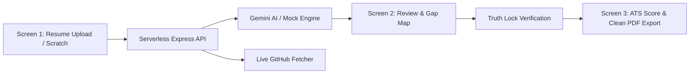

# CareerLens AI 🚀

<div align="center">


[](https://careerlens-ai-wheat.vercel.app)
[](https://github.com/sanjiv-18/gen-ai)

**ATS-Optimized · Company-Tailored · Truth-Locked AI Resume Architect**

[🌐 View Live Demo](https://careerlens-ai-wheat.vercel.app) · [📖 Features](#-key-features) · [🛠️ Tech Stack](#️-tech-stack) · [🚀 Getting Started](#-getting-started)

</div>

---

## 🌟 Overview

**CareerLens AI** is an intelligent, full-stack resume builder and ATS optimizer designed to bridge the gap between job seekers and automated applicant tracking systems. 

Unlike traditional resume builders that blindly inject keywords or hallucinate false experiences, CareerLens AI uses **deterministic Truth Lock verification** to ensure that every bullet point, metric, and skill added to your resume is strictly backed by your actual verified experience.

---

## 🔗 Live Application

- **Live URL:** [https://careerlens-ai-wheat.vercel.app](https://careerlens-ai-wheat.vercel.app)
- **Repo:** [https://github.com/sanjiv-18/gen-ai](https://github.com/sanjiv-18/gen-ai)

---

## ✨ Key Features

### 1. 🛡️ Truth Lock™ Verification (Anti-Hallucination Engine)
- **Zero Hallucinations:** LLM suggestions are analyzed deterministically against your source resume and explicit user confirmations.
- **Audit Trails:** Shows exactly what claims are verified vs unverified.
- **Clean Resume Export:** Internal audit buttons (such as "Confirm") are isolated to the review screen and **never** appear in the exported PDF.

### 2. 🎯 Company Lens Targeting
Custom tailoring algorithms tuned for specific hiring styles and cultural rubrics:
- **Zoho:** Product mindset, depth in core technologies, practical problem solving.
- **Amazon:** Leadership Principles (Customer Obsession, Ownership, Bias for Action), STAR method metrics.
- **TCS / Infosys:** Service enterprise competencies, certifications, foundational engineering.
- **Startup:** Full-stack agility, fast execution, product ownership, impact.

### 3. 🔍 Live GitHub Integration
- Automatically queries candidate's GitHub profile via the GitHub REST API.
- Pulls top repositories, tech stacks, and topics to match against the target job description.

### 4. 📊 ATS X-Ray & Match Score
- **Side-by-Side Scoring:** Real-time ATS match percentage before and after optimization.
- **Keyword Gap Map:** Visual breakdown of Strong, Weak, and Missing keywords.
- **Smart Clarification Questions:** Targeted micro-questions (max 3) to uncover missing project context without inflating claims.

### 5. 📄 One-Click ATS-Friendly PDF Export
- Generates clean, standard A4 formatted single-page resumes.
- Compliant with standard applicant tracking systems (Workday, Greenhouse, Lever, Taleo).

### 6. ⚡ One-Click Demo Presets
- **Fresher → Zoho:** Tailored for early-career developers targeting product companies.
- **Experienced → Amazon:** Tailored for mid-to-senior engineers with leadership metrics.

---

## 🏗️ Architecture



---

## 🛠️ Tech Stack

| Layer | Technology | Description |
|---|---|---|
| **Frontend** | React 18, Vite | High-performance SPA with Framer Motion animations |
| **Styling** | Modern CSS | Custom dark glassmorphism theme (`#080A18`), accessible WCAG contrast |
| **Icons** | Lucide React | Modern feather icon set |
| **Backend** | Node.js, Express | RESTful API with serverless HTTP wrappers |
| **AI Integration** | Google Gemini 2.0 Flash | `@google/generative-ai` with automated fallback mock engine |
| **Document Parsing** | `pdf-parse`, `mammoth` | Extraction from PDF, DOCX, and raw TXT |
| **Deployment** | Vercel (Multi-Service) | Vite SPA + Express API serverless functions |

---

## 🚀 Getting Started

### Prerequisites
- Node.js 18+ installed
- npm or yarn

### 1. Clone the Repository
```bash
git clone https://github.com/sanjiv-18/gen-ai.git
cd gen-ai
```

### 2. Install Dependencies
```bash
# Install root dependencies
npm install

# Install backend dependencies
cd server && npm install && cd ..
```

### 3. Run Locally

Run frontend and backend simultaneously:
```bash
npm start
```

Or run them individually in two terminals:
```bash
# Terminal 1: Backend (Express on port 5000)
cd server
node index.js

# Terminal 2: Frontend (Vite on port 5173)
npm run dev
```

- **Frontend:** [http://localhost:5173](http://localhost:5173)
- **Backend API:** [http://localhost:5000](http://localhost:5000)

---

## 🔑 Environment Variables (Optional)

Create a `.env` file in the root or `server/` directory:

```env
GEMINI_API_KEY=your_gemini_api_key_here
PORT=5000
```

> 💡 **Note:** If no Gemini API key is provided, the app automatically switches to an intelligent mock engine with full functionality for demonstrations.

---

## 🚢 Deployment

### Deploying on Vercel
The repository includes pre-configured [`vercel.json`](./vercel.json) supporting Vercel's multi-service architecture:

```bash
npx vercel --prod
```

### Deploying on Netlify
The repository also includes [`netlify.toml`](./netlify.toml) with Netlify Functions:

```bash
npx netlify deploy --prod
```

---

## 📄 License

This project is licensed under the MIT License — see the [LICENSE](LICENSE) file for details.
